# ZE Graph Website

This track all CS Zombie Escape related servers that I’m aware of, allowing you to view player playtime on each server. 
It was originally created to monitor only the GFL Zombie Escape server, but has since expanded to include several 
servers in the western community. Chinese servers are not tracked due to technical limitations on their servers. Only GFL and 
Mapeadores servers provide Steam IDs, enabling consistent tracking of individual players. Other servers rely solely 
on player names for tracking. Any request for me to track your own server, you can contact me through the provided email
address on the website.

The [website](https://zegraph.xyz/) is hosted on a smol vps, be nice :)

This is codebase is purely for displaying data from the database. Itself does
not store the player data and webscraping. Those are hidden. If you wish to host your own, you would need to implement
your own datascraping mechanism.

## How it works
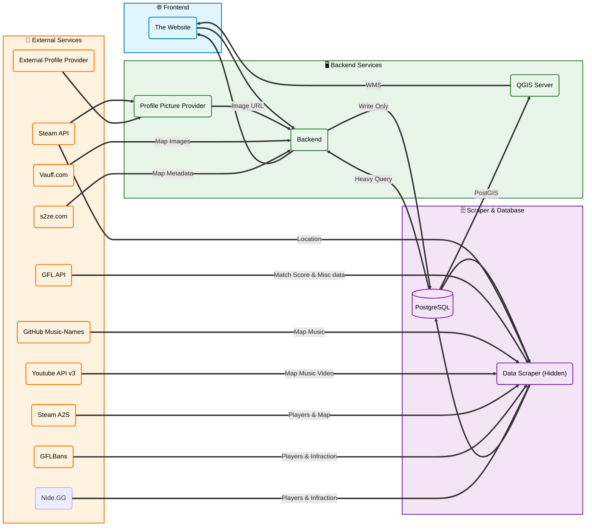
## Preview
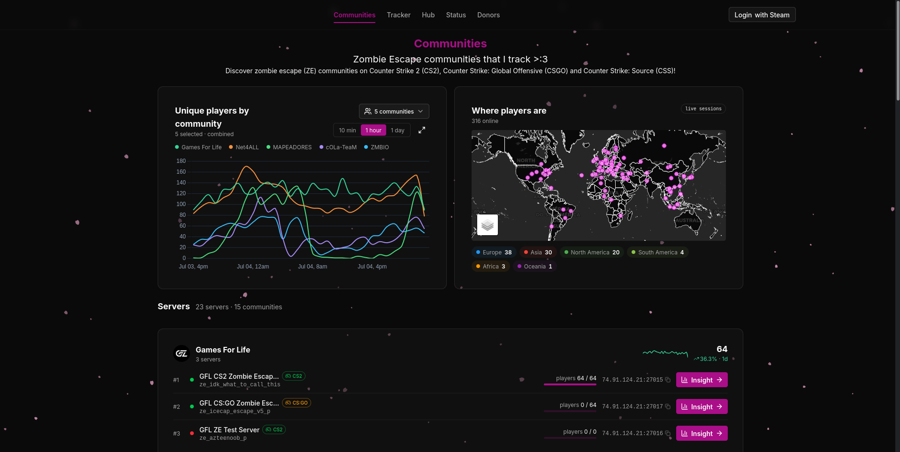

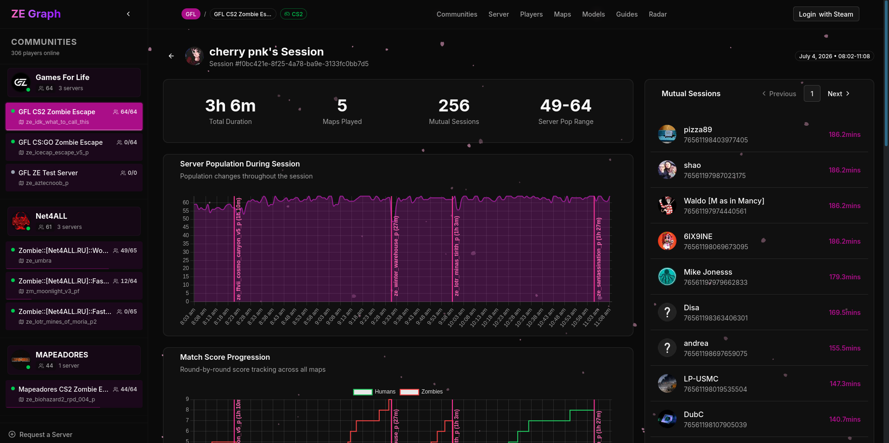

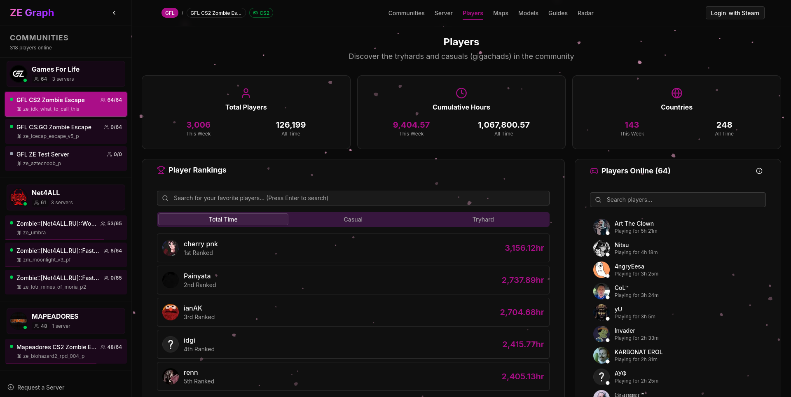

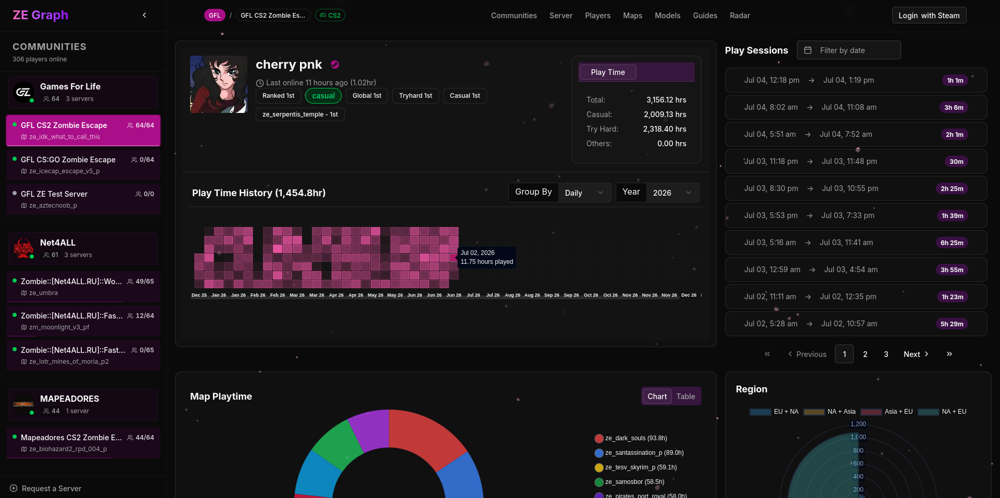

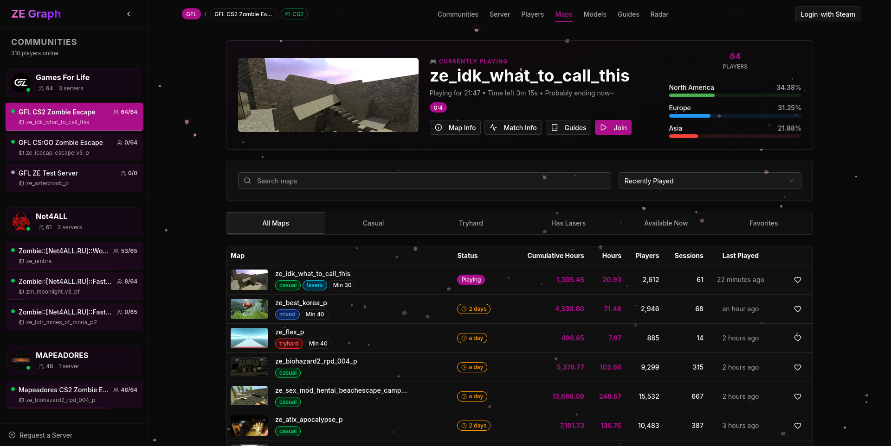

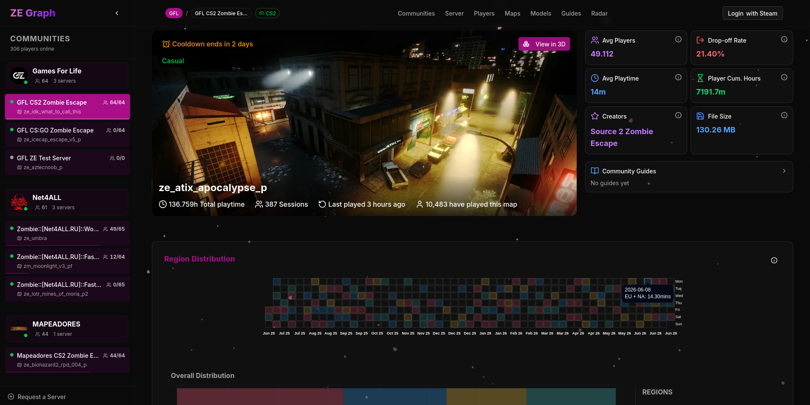

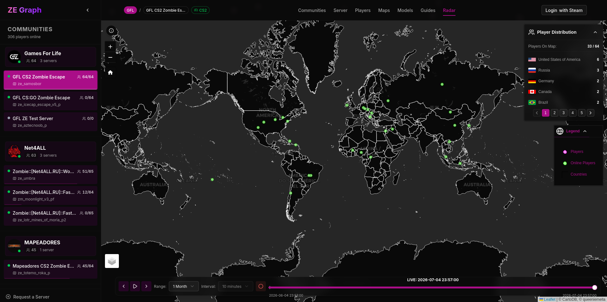

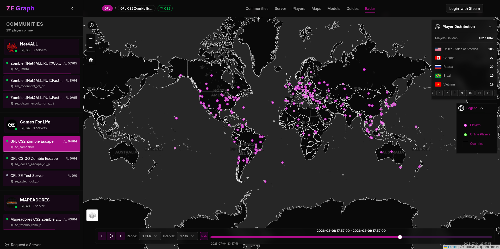

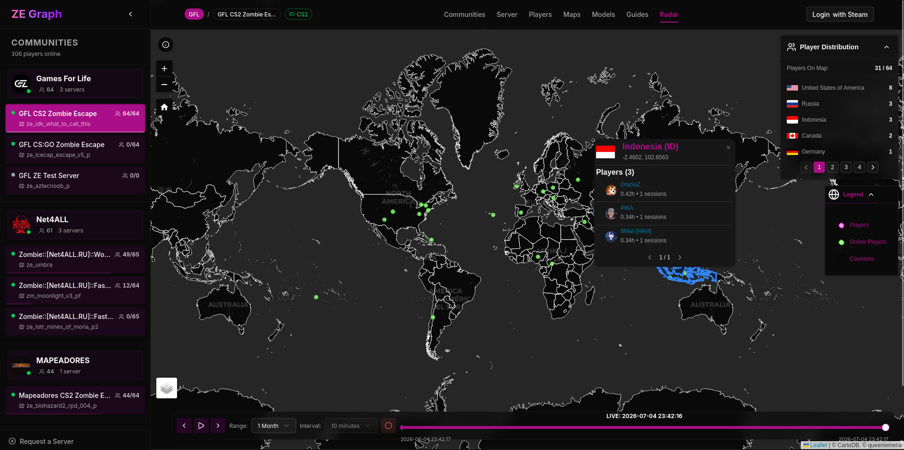

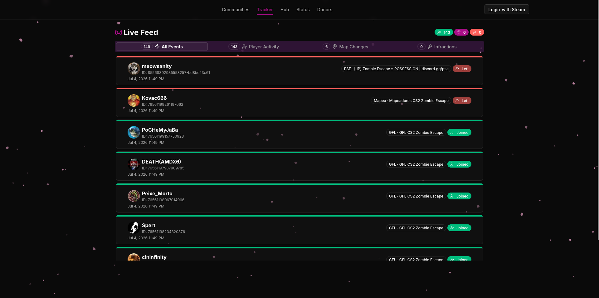