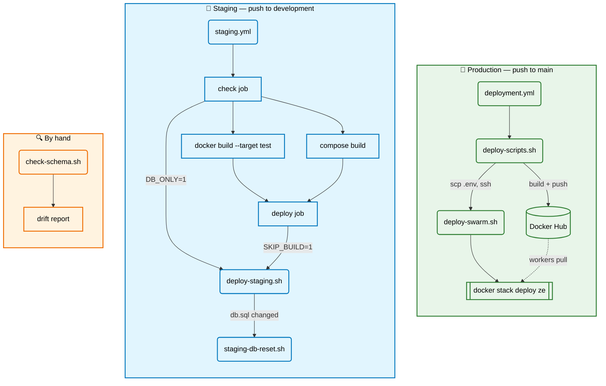

# Deployment

I'm showing you guys the workflow/deployment of this project so you can self-host it on your own. Remember, this website
does not cover data scraper which is the most complex part of the codebase. It is hidden and you have to do it yourself.
This is to prevent some freeloaders like vibecoders from creating a new site with 0 substance.

Five bash scripts: four deploy the stack (two for production, two for staging), one keeps `db.sql`
honest against a live database.

They all `cd` to the repo root on startup, so it does not matter where you run them from —
`bash ./deployment/<script>.sh` works from anywhere. They all read the repo-root `.env`, and none of
them will run without it.

## Summary

| Script | What it does | Runs on | Called by |
|---|---|---|---|
| `deploy-scripts.sh` | Build, push to Docker Hub, ship `.env` and deploy to the VPS | the runner, or your machine | `.github/workflows/deployment.yml`, on push to `main` |
| `deploy-swarm.sh` | `docker stack deploy` with `.env` loaded into the environment | the VPS (swarm manager) | `deploy-scripts.sh`, over ssh |
| `deploy-staging.sh` | Build and run the staging stack on the same host | the runner | `.github/workflows/staging.yml`, on push to `development` |
| `staging-db-reset.sh` | Drop the staging database and replay `db.sql` into a fresh one | the runner | `deploy-staging.sh`, when the schema marker does not match |
| `check-schema.sh` | Diff a live database against `db.sql` and report the drift | anywhere with `psql` | nothing — run it by hand |



## `deploy-scripts.sh`

The production deploy, driven from the runner. It builds the `compose.yaml` images and pushes them to
Docker Hub, checks the VPS is reachable over ssh, copies `.env` up, then hands over to
`deploy-swarm.sh` on the other side.

```bash
bash ./deployment/deploy-scripts.sh
```

| Variable | Effect |
|---|---|
| `SSH_CONFIG_FILE` | ssh config to use. CI builds a throwaway one from secrets and points here; unset locally, so the `server` alias in `~/.ssh/config` is used instead. |
| `GITHUB_ACTIONS` | Set by Actions. When present the leading `git pull` is skipped. |

Notes:

- The `git pull` only happens outside CI. `actions/checkout` already places the exact pushed commit,
  and pulling on its detached HEAD would fail.
- The ssh reachability probe (`-o BatchMode=yes -o ConnectTimeout=10 server true`) runs *before* the
  `scp`, so an unreachable VPS aborts the deploy instead of failing halfway through the upload.
- The remote side runs `git pull && bash ./deployment/deploy-swarm.sh` in `~/gfl-ze-watcher`, so the
  VPS needs a checkout there.

## `deploy-swarm.sh`

Runs **on the VPS**, from the repo root. It sources `.env` into the environment and then
`docker stack deploy`s `compose-swarm.yaml`.

```bash
./deployment/deploy-swarm.sh
```

Notes:

- This is the whole reason the script exists: `docker stack deploy` does **not** read `.env` the way
  `docker compose` does. It only interpolates `${VAR}` from the shell environment, so without the
  `set -a; . ./.env; set +a` every `${MAPS_PATH}`, `${DB_HOST}` and friend would resolve to empty and
  silently break mounts and DB connectivity.
- It refuses to deploy if `.env` is missing, rather than deploying with empty vars.
- `ze` is the stack name, so services come out as `ze_backend`, `ze_qgis-server`, and so on.
  `--with-registry-auth` ships the Docker Hub credentials so workers can pull the private images;
  `--prune` removes services that were deleted from the compose file.

## `deploy-staging.sh`

Brings up the staging stack on the machine it is run from. It is the staging counterpart of
`deploy-scripts.sh` minus the parts that only make sense for production: it builds and runs on the same
host, so there is no registry push and no ssh hop. Everything lives in the `ze-staging` compose project.

```bash
./deployment/deploy-staging.sh                # reset the database only if db.sql changed, then deploy
RESET_DB=1 ./deployment/deploy-staging.sh     # force a database rebuild
DB_ONLY=1 ./deployment/deploy-staging.sh      # bring up and seed the database, stop there
SKIP_BUILD=1 ./deployment/deploy-staging.sh   # images were already built
```

| Variable | Default | Effect |
|---|---|---|
| `RESET_DB` | `0` | `1` rebuilds the database even when `db.sql` has not changed. |
| `DB_ONLY` | `0` | `1` stops after the database is up and seeded. |
| `SKIP_BUILD` | `0` | `1` skips `docker compose build`. |
| `STAGING_PROJECT` | `ze-staging` | Compose project name. |
| `STAGING_COMPOSE_FILE` | `compose.staging.yaml` | Compose file. |
| `STAGING_EXPOSE_PORT` | `51021` | Only used in the closing message. |
| `STAGING_DB_HOST_ADDR` / `_PORT` | `172.17.0.1` / `55432` | Only used in the `DB_ONLY` message. |

Notes:

- **Why `DB_ONLY` exists:** sqlx resolves `query!` at compile time, so the database must already carry
  this branch's `db.sql` before anything is built. CI calls `DB_ONLY=1` in the gate job and
  `SKIP_BUILD=1` in the deploy job, where the schema marker makes the reset a no-op.
- `.env` is required, and `DB_NAME`, `DB_USERNAME`, `DATABASE_URL` and `BUILD_DATABASE_URL` must all be
  set in it. Copy `default.staging.env` and fill it in.
- `docker compose up -d` returns before the healthcheck passes, so postgres is polled for up to two
  minutes before anything downstream is allowed to touch it.
- The reset decision comes from `public.staging_schema_marker`, which records the sha256 of the `db.sql`
  the database was built from. A missing table — fresh volume, or an interrupted replay — reads as empty
  and forces a rebuild. `backend` and `worker` are stopped first, because a live backend would otherwise
  sit on a dead connection pool.
- It ends with `docker image prune -f`; rebuilding every service on every push leaves a lot of dangling
  layers on a home machine.

## `staging-db-reset.sh`

> [!WARNING]
> Two of these scripts drop databases. `staging-db-reset.sh` drops `$DB_NAME`, but only ever inside the
> `ze-staging` compose project. `check-schema.sh` only ever drops `ze_schema_check` — however it creates
> it on whatever server `DATABASE_URL` points at, which is normally **production**.

Rebuilds the staging database from `db.sql`. Staging starts empty on purpose, so this drops the database
outright and replays `db.sql` into a fresh one.

```bash
./deployment/staging-db-reset.sh          # drop, recreate, replay db.sql
```

Reads `DB_NAME` and `DB_USERNAME` from the environment, falling back to `.env`. Honours
`STAGING_PROJECT` and `STAGING_COMPOSE_FILE` the same way `deploy-staging.sh` does.

Notes:

- It can only ever reach the `postgres` service inside the `ze-staging` compose project, so it has no
  way to touch the production database even if the `.env` is wrong. It refuses to run if that service
  is not already up.
- psql runs inside the container, so the machine running this needs no postgres client installed.
- `DROP DATABASE ... WITH (FORCE)` terminates any backend/worker connections still holding the old
  database open.
- pg_cron is the one thing `db.sql` cannot bring with it: it is not in the postgis image, and it can only
  ever live on one database per cluster. A stub `cron.schedule_in_database` is installed first so the
  rest of `db.sql` runs untouched and the scheduled jobs are recorded instead. The trade-off is that
  **materialized views never refresh in staging**.
- Any `ERROR` or `FATAL` during the replay fails the script — the staging database is not usable until
  `db.sql` loads cleanly.
- The schema marker is written **last**, so an interrupted replay leaves no marker behind and the next
  deploy rebuilds.

## `check-schema.sh`

> [!WARNING]
> Two of these scripts drop databases. `staging-db-reset.sh` drops `$DB_NAME`, but only ever inside the
> `ze-staging` compose project. `check-schema.sh` only ever drops `ze_schema_check` — however it creates
> it on whatever server `DATABASE_URL` points at, which is normally **production**.


Checks whether a live database actually matches `db.sql`. `db.sql` is hand-maintained, so it drifts.
Rather than parsing it, this replays it into a throwaway database on the same server, then dumps the
catalog of both sides and diffs them.

A `-` line is something `db.sql` declares that the live database is missing; a `+` line is something the
live database has that `db.sql` never mentions.

```bash
./deployment/check-schema.sh                 # replay db.sql, diff every section
./deployment/check-schema.sh --lint          # only check that db.sql is valid SQL, skip the diff
./deployment/check-schema.sh columns indexes # only diff the named sections
./deployment/check-schema.sh --keep          # leave the scratch database behind for poking at
```

| Flag | Effect |
|---|---|
| `--lint`, `-l` | Only verify `db.sql` replays cleanly. Exits non-zero if it does not. |
| `--keep`, `-k` | Leave the scratch database behind instead of dropping it. |
| `--force`, `-f` | Diff even though the replay produced errors. |
| `--help`, `-h` | Print the usage header. |
| *(positional)* | Section names to diff. Default is all of them. |

Sections: `extensions` `enums` `columns` `constraints` `indexes` `views` `functions` `triggers` `cron`.

| Variable | Effect |
|---|---|
| `DATABASE_URL` | The database to check. Falls back to `.env`. |
| `PSQL` | Path to `psql`. Auto-detected, see below. |

Notes:

- The scratch database (`ze_schema_check`) is created on the **same server** as `DATABASE_URL`, so both
  sides agree on server version and available extensions — only the database name differs. It is dropped
  and recreated on every run, and the script refuses to start if `DATABASE_URL` already points at it.
- Everything an extension installed is excluded from the diff (postgis alone brings ~1000 functions),
  along with the catalog schemas and the `layers` schema, which is imported by hand through QGIS and so
  cannot be rebuilt from a replay.
- pg_cron gets the same stub treatment as in `staging-db-reset.sh`, which is what makes the `cron`
  section possible: the scratch side reports what `db.sql` asked to schedule, the live side reports what
  pg_cron actually has.
- When the replay fails, errors are split into root causes and knock-on `does not exist` failures — one
  bad `CREATE TABLE` cascades into every later reference to it. By default the diff is refused while
  `db.sql` fails to load, since it would be meaningless; `--force` overrides that.
- psql is rarely on PATH on Windows, so it falls back to the newest
  `C:\Program Files\PostgreSQL\*\bin\psql.exe`. Set `PSQL=` to override.

## Environment and prerequisites

- **`.env` at the repo root.** Every script reads it. `default.env` is the production template,
  `default.staging.env` the staging one — copy and fill in.
- **In CI** the file is never committed. Both workflows copy it from an absolute path on the runner,
  given by the `ENV_LOCATION` (production) and `STAGING_ENV_LOCATION` (staging) repository variables,
  and delete it again in an `if: always()` step. These are two different files and must stay that way.
- **Production** additionally needs a `server` ssh alias resolving to the VPS (or `SSH_CONFIG_FILE`
  pointing at a config that defines one), a Docker Hub login for the push, and a checkout at
  `~/gfl-ze-watcher` on the VPS with swarm already initialised.
- **`check-schema.sh`** needs `psql` and nothing else — it does not go through compose.
