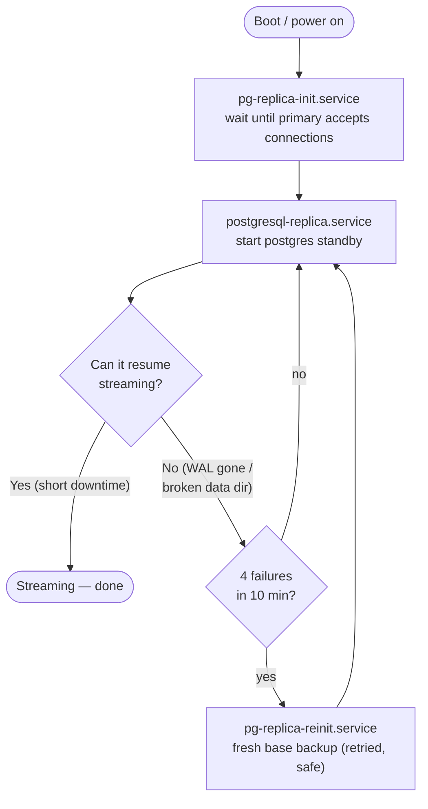

# PostgreSQL Read-Replica with Self-Healing Auto-Recovery

A small, transparent setup that keeps a **streaming read-replica** of the project's
production PostgreSQL database on a secondary machine (e.g. a home PC) over
[Tailscale](https://tailscale.com/). It is designed for a machine that gets **powered off
and on irregularly** — when the replica falls too far behind to catch up by streaming, it
**rebuilds itself automatically from the primary on the next boot**, with no manual steps.

This replica is read-only and intended for analytics / heavy queries / a local hot spare —
it does not accept external connections and never writes back to the primary.

---

## Why this exists

A plain streaming replica works great until the replica is offline long enough that the
primary recycles the [WAL](https://www.postgresql.org/docs/current/wal-intro.html) the
replica still needs. The primary here caps retained WAL at **5 GB**
(`max_slot_wal_keep_size = 5GB`) so a long-offline replica can never fill the primary's
disk. The trade-off: after a long power-off the replica can no longer resume by streaming
and must take a fresh base backup. This system automates exactly that, safely.

Three failure modes that an earlier naive version kept hitting — and which this design
fixes for good:

| Failure | Cause | Fix here |
|---------|-------|----------|
| `could not load pg_hba.conf` / `could not access postgresql.conf` | Config lived *inside* the data dir and was rewritten by a script each rebuild; one missing file = dead replica | Config lives **outside** the data dir in `replica-conf/` — a rebuild can't wipe it and no script needs to recreate it |
| `pg_basebackup: server closed the connection unexpectedly` mid-transfer | A single dropped connection over a high-latency link aborted the whole rebuild with no retry | The rebuild **retries the base backup in a loop** until it completes |
| Empty/broken data dir after an interrupted rebuild | The old script `rm -rf`'d the live data dir *before* the new backup finished | The rebuild builds into a **temp dir and swaps in only on success** |

---

## Architecture

```mermaid
flowchart LR
  subgraph Primary["Primary (cloud server)"]
    P[("PostgreSQL :5432<br/>wal_level=replica<br/>max_slot_wal_keep_size=5GB")]
    SLOT["replication slot<br/>replica_pc"]
    P --- SLOT
  end
  subgraph TS["Tailscale (encrypted mesh VPN)"]
  end
  subgraph Replica["Replica (this machine)"]
    R[("PostgreSQL :5433<br/>hot standby")]
    CONF["/var/lib/postgres/replica-conf<br/>postgresql.conf · pg_hba.conf"]
    R -. reads static config .- CONF
  end
  P == "stream WAL via slot" ==> TS == ==> R
```

### How recovery is decided (the boot path)



A **short** reboot just resumes streaming. Only a genuinely unrecoverable replica escalates
to a full rebuild — and a *clean* shutdown is not a failure, so a normal power-off never
triggers a needless rebuild.

---

## The three systemd units

| Unit | Type | Role |
|------|------|------|
| `pg-replica-init.service` | `oneshot` | **Boot gate.** Runs `pg-replica-init.sh`, which blocks (via `pg_isready`) until the primary's Postgres is actually accepting connections. The replica `Requires=`/`After=` it, so the replica never starts before the primary is reachable. |
| `postgresql-replica.service` | `notify` | **The replica.** Runs `postgres --config-file=…/replica-conf/postgresql.conf`. `Restart=on-failure` (retries transient hiccups); `StartLimitBurst=4` / `StartLimitIntervalSec=600` (after 4 failures in 10 min it gives up and fires `OnFailure=pg-replica-reinit`). Enabled at boot. |
| `pg-replica-reinit.service` | `oneshot` | **Self-healer.** Runs `pg-replica-reinit.sh` to rebuild from the primary, then `ExecStartPost=` clears the failed state and starts the replica again. `TimeoutSec=7200` so a slow multi-GB transfer isn't killed. `static` — only ever triggered, never enabled directly. |

### Where config lives — and why

```
/var/lib/postgres/
├── replica/                     # DATA DIRECTORY (wiped & rebuilt by pg_basebackup)
│   ├── postgresql.auto.conf     #   primary_conninfo + slot — regenerated by `pg_basebackup -R`
│   ├── standby.signal           #   marks this as a standby — written by `-R`
│   └── …                        #   actual database files
└── replica-conf/                # STATIC CONFIG (never touched by a rebuild)
    ├── postgresql.conf          #   data_directory, port 5433, hot_standby, file paths
    ├── pg_hba.conf              #   local-only trust auth
    └── pg_ident.conf            #   empty (required because ident_file points to it)
```

Keeping the static config **outside** the data directory is the key robustness decision:
`pg_basebackup` wiping `replica/` on every rebuild can never delete it, and the rebuild
script never has to recreate it (the original bug). Connection details, by contrast,
*belong* in the data dir's `postgresql.auto.conf` because `pg_basebackup -R` regenerates
them on each rebuild.

---

## Repository layout

```
replication/
├── README.md                       # this file
├── install.sh                      # idempotent installer (run with sudo)
├── config/
│   ├── replica.env                 # ← the ONE file you edit per machine
│   ├── postgresql.conf             # → /var/lib/postgres/replica-conf/postgresql.conf
│   ├── pg_hba.conf                 # → /var/lib/postgres/replica-conf/pg_hba.conf
│   └── pg_ident.conf               # → /var/lib/postgres/replica-conf/pg_ident.conf
├── scripts/
│   ├── pg-replica-init.sh          # → /usr/local/bin/pg-replica-init.sh
│   └── pg-replica-reinit.sh        # → /usr/local/bin/pg-replica-reinit.sh
└── systemd/
    ├── pg-replica-init.service     # → /etc/systemd/system/…
    ├── postgresql-replica.service  # → /etc/systemd/system/…
    └── pg-replica-reinit.service   # → /etc/systemd/system/…
```

---

## Prerequisites

### On the replica machine (where you install this)

- **PostgreSQL 18.x** server binaries + client tools (`postgres`, `pg_basebackup`,
  `pg_isready`, `psql`). The major version **must match the primary**.
- A `postgres` OS user, and an empty intended data directory at `/var/lib/postgres/replica`
  (created on first rebuild).
- **Tailscale** installed and logged in (`tailscaled.service` running), able to reach the
  primary's Tailscale IP. Any other network works too — just set `PRIMARY` accordingly.
- `systemd`.

### On the primary (one-time setup, if not already done)

```sql
-- 1. A replication role.
CREATE ROLE replicator WITH REPLICATION LOGIN PASSWORD '…';
```

```ini
# 2. postgresql.conf
wal_level = replica                 # minimum for streaming replication
max_wal_senders = 10                # >= number of replicas + base backups
max_slot_wal_keep_size = 5GB        # cap retained WAL so an offline replica
                                    # can't fill the primary's disk
```

```conf
# 3. pg_hba.conf — allow the replica in over Tailscale (CGNAT range 100.64.0.0/10),
#    or narrow it to the replica's exact Tailscale IP.
host    replication    replicator    100.64.0.0/10    scram-sha-256
```

The replication **slot** (`replica_pc`) is created automatically by the rebuild
(`pg_basebackup -C`); you do not pre-create it.

> **Credentials:** the replica authenticates to the primary using the connection info that
> `pg_basebackup -R` bakes into `postgresql.auto.conf`. If your primary requires a password,
> provide it to `pg_basebackup` out-of-band (e.g. a `~/.pgpass` entry for the `postgres`
> user, or `PGPASSWORD`) so the unattended rebuild can authenticate. Never commit it.

---

## Installation (on a new machine)

```bash
git clone https://github.com/InterStella0/gfl-ze-watcher
cd gfl-ze-watcher/replication

# 1. Set your deployment values (primary address, user, slot, paths).
$EDITOR config/replica.env

# 2. Install scripts, config, and units; reload systemd; enable at boot.
sudo ./install.sh

# 3. First-time bootstrap: take the initial base backup from the primary.
sudo systemctl start pg-replica-reinit.service
journalctl -u pg-replica-reinit -f          # watch the download
```

When the rebuild finishes it auto-starts the replica. `install.sh` is idempotent — re-run
it any time you change a file in this directory.

> **Distro note:** paths assume Arch-style PostgreSQL (`/usr/bin/postgres`, data under
> `/var/lib/postgres`). On Debian/Ubuntu the binary is under
> `/usr/lib/postgresql/<ver>/bin/postgres` — adjust `ExecStart=` in
> `systemd/postgresql-replica.service` and the paths in `config/replica.env` accordingly.

---

## Configuration reference (`config/replica.env`)

| Variable | Default | Meaning |
|----------|---------|---------|
| `PRIMARY` | *(required)* | Address of the primary the replica connects to (its Tailscale IP, or any reachable host). |
| `PRIMARY_PORT` | `5432` | Primary's PostgreSQL port. |
| `REPL_USER` | `replicator` | Replication role on the primary. |
| `SLOT` | `replica_pc` | Physical replication slot name (auto-created via `-C`). |
| `PGDATA` | `/var/lib/postgres/replica` | The replica's data directory. |
| `CONFDIR` | `/var/lib/postgres/replica-conf` | Static config location (outside the data dir). |

To change the listen port (default **5433**) or `hot_standby`, edit
`config/postgresql.conf` and re-run `install.sh`.

---

## Verification

```bash
# Service is up
systemctl is-active postgresql-replica                      # -> active

# It is a standby and replaying
psql -p 5433 -At -c "SELECT pg_is_in_recovery();"           # -> t

# It is actively streaming from the primary
psql -p 5433 -xc "SELECT status, sender_host, slot_name FROM pg_stat_wal_receiver;"
#   status      | streaming
#   sender_host | <primary>
#   slot_name   | replica_pc

# Replication lag
psql -p 5433 -At -c "SELECT now() - pg_last_xact_replay_timestamp();"

# Config really is outside the data dir
psql -p 5433 -At -c "SHOW hba_file; SHOW config_file;"
#   /var/lib/postgres/replica-conf/pg_hba.conf
#   /var/lib/postgres/replica-conf/postgresql.conf
```

**The real test — reboot survival:** `sudo reboot`. After boot the replica should end up
`active` and streaming on its own (a short reboot resumes; a long one auto-rebuilds), with
no manual intervention.

---

## Operations

```bash
# Watch the replica's log
journalctl -u postgresql-replica -f

# Watch a rebuild in progress
journalctl -u pg-replica-reinit -f

# Force a full rebuild from the primary (e.g. suspected corruption)
sudo systemctl start pg-replica-reinit.service

# Stop / start the replica
sudo systemctl stop postgresql-replica
sudo systemctl start postgresql-replica
```

---

## Troubleshooting

| Symptom | Likely cause / fix |
|---------|--------------------|
| `requested WAL segment … has already been removed` | Normal after a long downtime — the primary recycled the WAL (5 GB cap). The replica will fail to stream and auto-rebuild. No action needed. |
| Rebuild keeps printing `Backup interrupted (network?), retrying…` | The Tailscale link is dropping mid-transfer. It will keep retrying; check `tailscale status` and the primary's reachability if it never completes. |
| `pg_isready` never succeeds at boot | Primary is down or unreachable. `pg-replica-init` waits (up to its timeout) and the replica won't start — safe, no destructive action. |
| Replica `active` but not streaming | Check `pg_stat_wal_receiver` is non-empty and the slot exists on the primary (`SELECT * FROM pg_replication_slots`). |
| `FATAL: database files are incompatible with server` | Replica's PostgreSQL major version differs from the primary's. They must match. |

---

## Design notes & limitations

- **A long power-off means a full re-download.** Bootstrapping is a complete base backup
  (the production DB is multi-GB), so after the WAL has been recycled the replica is
  unavailable for the duration of that transfer. This is inherent to the 5 GB WAL cap, not
  a bug — it's the deliberate trade-off that protects the primary's disk.
- **Read-only.** This is a standby; it never writes back. Local `pg_hba.conf` is
  trust-on-localhost only and exposes nothing to the network.
- **No automatic failover/promotion.** Promoting this replica to a primary is intentionally
  a manual decision and out of scope.

---

## License

Part of [zegraph-web](https://github.com/InterStella0/zegraph-web); see the
repository's [LICENSE](../LICENSE).
